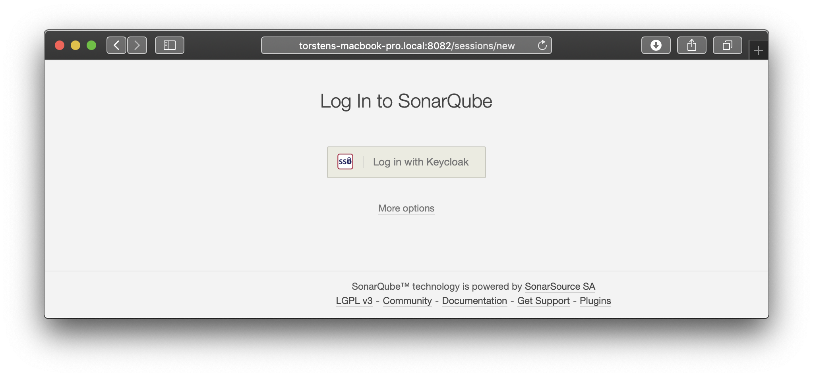
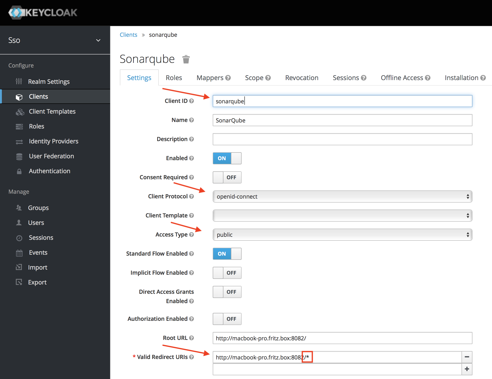
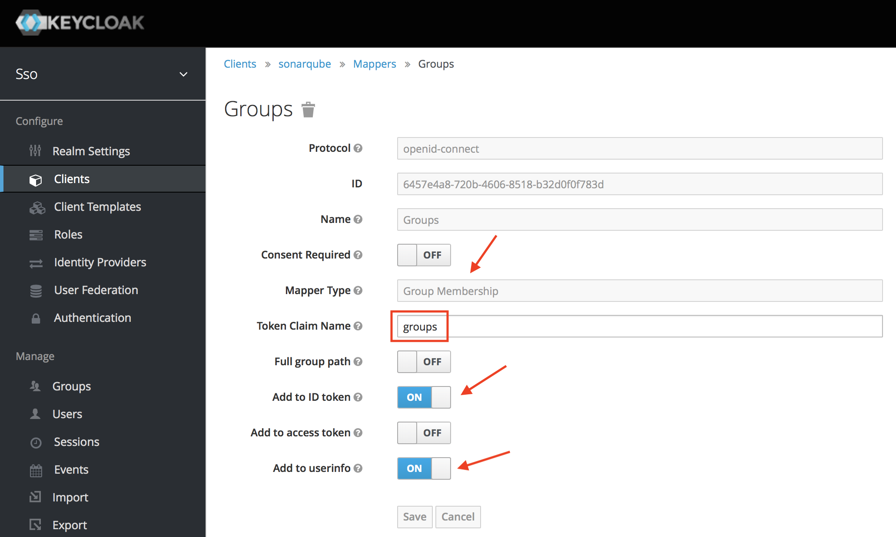
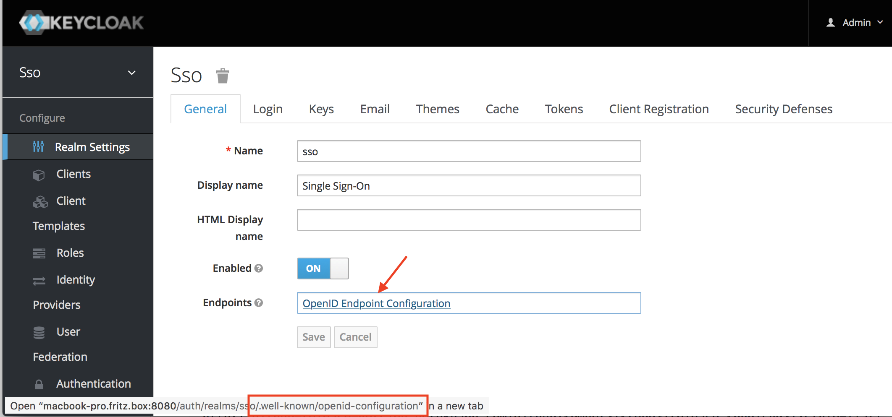
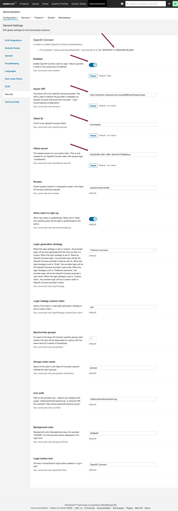
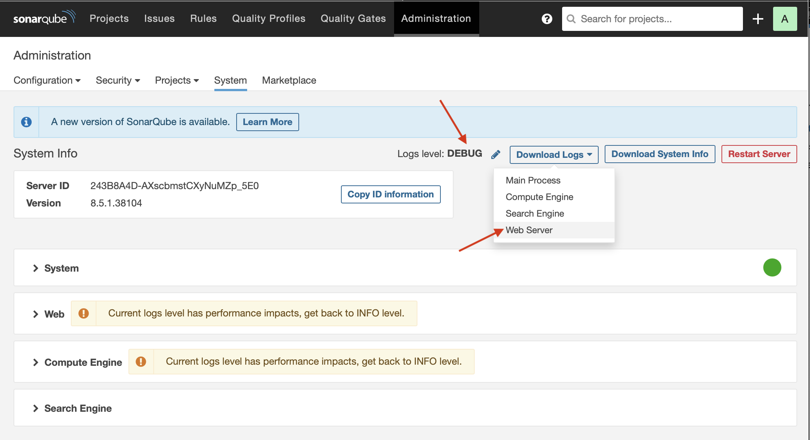
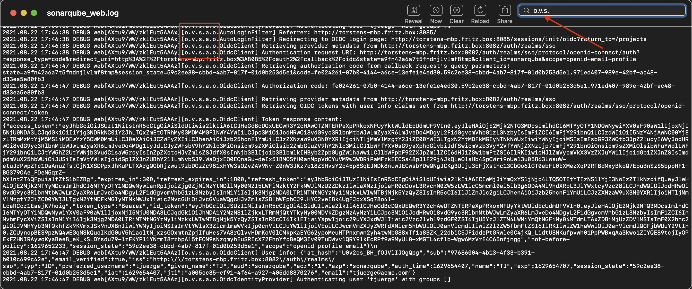

# OpenID Connect (OIDC) Plugin for SonarQube
   

## Description

This plugin enables users to automatically be sign up and authenticated on a SonarQube server via an [OpenID Connect](http://openid.net/connect/) identity provider like [Keycloak](http://www.keycloak.org).

Optionally the groups a user is associated in SonarQube can be synchronized with the provider (via a custom userinfo claim retrieved from the ID token).

For communicating with the OpenID Connect provider this plugin uses the [Nimbus OAuth 2.0 SDK with OpenID Connect extensions](https://connect2id.com/products/nimbus-oauth-openid-connect-sdk).

## Prerequisites

### Server Base URL

SonarQube's `Server base URL` property must be set either by setting the
URL from SonarQube administration page (General > Server base URL) or the property `sonar.core.serverBaseURL` in the `sonar.properties`.

**In this URL no trailing slash is allowed!** Otherwise the redirects from the identity provider back to the SonarQube server are not created correctly.

### Force user authentication

If the plugin's Auto-Login feature is enabled then SonarQube's `Force user authentication` property must be enabled either from SonarQube administration page (Security > Force user authentication) or the property `sonar.forceAuthentication` in the `sonar.properties`.

**Otherwise the plugin won't be able to automatically redirect to the IdP's login page.**

### Network Proxy

If a [network proxy](https://docs.oracle.com/javase/8/docs/api/java/net/doc-files/net-properties.html#Proxies) is used with SonarQube (via `http[s].proxy[Host|Port]` properties in the `sonar.properties`) and the host name of the identity provider is not resolvable by this proxy then the IdP's host name must be excluded from being resolved by the proxy. This is done by defining the property `http.nonProxyHosts` in the `sonar.properties`.

**Otherwise the plugin won't be able to send the token request to the IdP.**

## Installation

1. Install the plugin from [SonarQube marketplace](https://docs.sonarqube.org/display/SONAR/Marketplace) via "Administration > Marketplace". Or download the plugin jar from [GitHub Releases](https://github.com/vaulttec/sonar-auth-oidc/releases) and put it into the `SONARQUBE_HOME/extensions/plugins/` directory
1. Restart the SonarQube server

## Configuration

- In OpenID Connect identity provider:
  - Create a client with access type 'public' or 'confidential' (in the latter case the corresponding client secret must be set in the plugin configuration) and white-list the redirect URI for the SonarQube server `https://<sonarqube base>/oauth2/callback/oidc`
    

    **Some IdP's (e.g. Keycloak) are supporting wildcards in the redirect URI white-list. Otherwise the absolute redirect URI must be white-listed.**

  - For synchronizing SonarQube groups create a mapper which adds group names to a custom userinfo claim in the ID token (the claim's name is used in the plugin configuration later on)
    

    **Make sure that the identity provider creates a groups claim with groups marshalled as a JSON string array, e.g. `["Group"]` or `["Group 1", "Group 2", "Group 3"]`. Otherwise the plugin is not able to retrieve the group list from the userinfo claim. The userinfo JSON object is available in [SonarQube's debug log](#troubleshooting).**

  - The [provider's discovery URI](https://openid.net/specs/openid-connect-discovery-1_0.html) (without the [`/.well-known/openid-configuration`](https://openid.net/specs/openid-connect-discovery-1_0.html#ProviderConfig) path) is needed for the plugin configuration (Issuer URI)
    

- In SonarQube administration (General > Security > OpenID Connect):
  - Configure the plugin for the OpenID Connect client (a client secret is only required for clients with access type 'confidential')
    

  - If Auto-Login is enabled then the logout from SonarQube is not possible anymore. This is because logout redirects to SonarQube's login page which triggers the Auto-Login.

    **To skip Auto-Login use the URL `<sonarServerBaseURL>/?auto-login=false` in a new browser session (without cookie from previous SonarQube login).**

  - For synchronizing groups the name of the custom userinfo claim must be the same as defined in the identity provider's group mapper.

    **Make sure that the identity provider creates a groups claim with groups marshalled as a JSON string array, e.g. `["Group"]` or `["Group 1", "Group 2", "Group 3"]`. Otherwise the plugin is not able to retrieve the group list from the userinfo claim.**

## Troubleshooting

To troubleshoot issues with this plugin activate [SonarQube's debug logging](https://docs.sonarqube.org/latest/instance-administration/system-info/) (Administration > System > Logs level) and download the Web Server log:

In the Web Server log file the plugin's log entries can be identified by the package name of it's Java classes `org.vaulttec.sonarqube.auth.oidc` which is abbreviated as `o.v.s.a.o`:

## Tested with

* SonarQube 7.9.1, 8.2, 8.5.1, 9.2.4
* Keycloak 4.8.1.Final, 12.0.4, 16.1.0
* JetBrains Hub 2017.4
* Okta 2018.25
